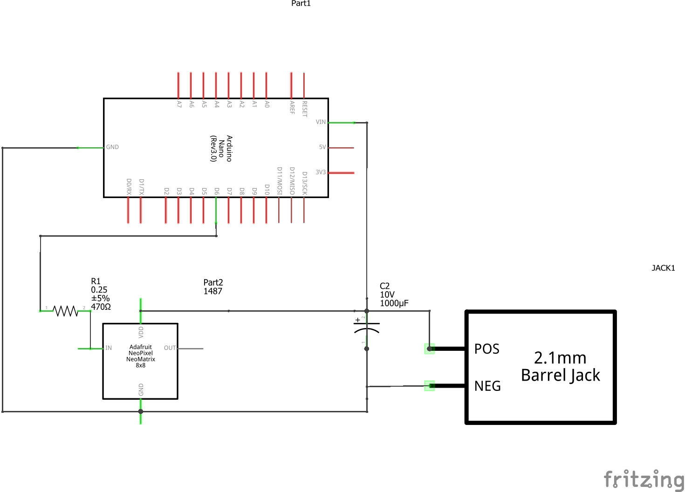
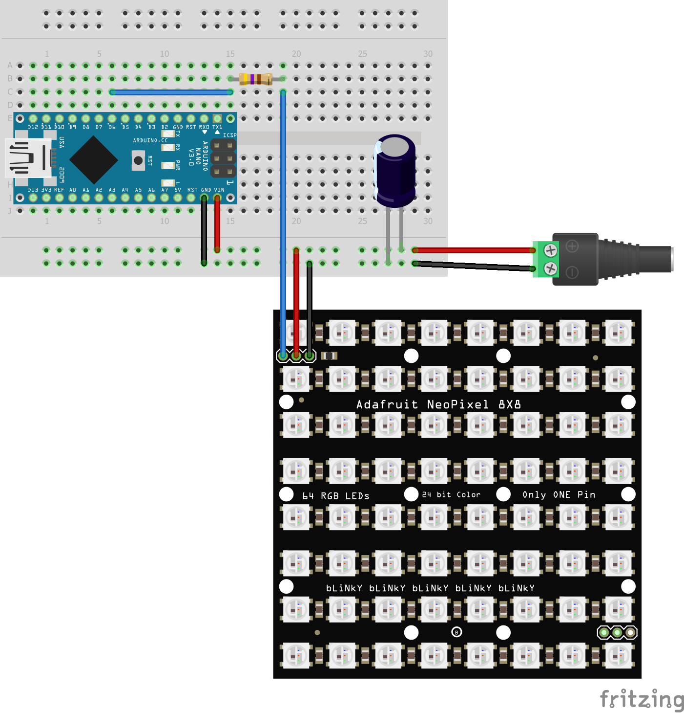
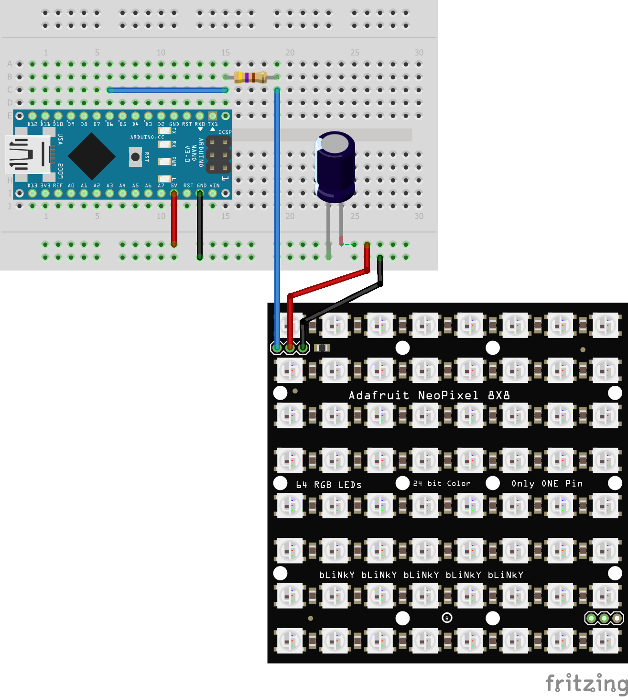

# SimHubMatrixFlagLights
Companion repository for the TDSR SimHub Matrix 8x8 flag light video

## Project Hardware

- Arduino Nano - £2-£8 - https://www.aliexpress.com/item/1005003097482179.html | https://www.amazon.co.uk/AZDelivery-Atmega328-CH340-compatible-Arduino/dp/B01LWSJBTD
- 1000uf Capacitor (10v) - £0.60 - £3 - https://www.aliexpress.com/item/1005002733361851.html | https://www.amazon.co.uk/Panasonic-Degrees-Electrolytic-Capacitors-Diameter/dp/B00U36LOD8
- 470 ohm Resistor - ¼ or ½ watt should suffice, I tend to buy them in the hundreds but you should be able to pick up a few cheaply.
- Junction Box (90x115x40mm) - £5 - £10 - https://www.aliexpress.com/item/4001111875158.html | https://www.amazon.co.uk/gp/product/B07FKS9JXQ
   *Note: The Amazon box is a bit bigger at 50mm deep.*
- RGB Matrix Panel - £2 - £8 - https://www.aliexpress.com/item/32648827805.html | https://www.ebay.co.uk/itm/192864994731
   *Note: I haven’t tried the Aliexpress panel yet.*
- 2amp 5 volt Power Supply - £10 - https://www.amazon.co.uk/SHNITPWR-Adapter-Converter-Transformer-Monitor/dp/B08GKFW6DK

You’ll also need solder, a soldering iron, some wire to hook it all up and a hot glue gun or some other way to attach the components to your case.  It’s also a good idea to have a multi-meter for testing but if you don’t have one it isn’t the end of the world, it’ll just make debugging a little harder if you have issues.

## Circuit

The circuit that makes up the flag light is fairly straight forward.  It adds a bypass capacitor as per the Adafruit recommendations and the Arduino shares a common ground with all components.

The powered version of the circuit first interfaces with a bypass capacitor, then the NeoPixel before the microcontroller, this should stop any leaching of power from the vin pin.  Be sure to check the voltage and polarity of your power supply before connecting to the circuit as if the power is reversed it'll instantly pop the capacitor.

These matrix displays are very bright, way beyond the need for most sim racing applications.  I run mine at 50% brightness.  The unit seems to be able to hold power even as low as 20% which would allow it to be run via the power drawn from the Nano.  I've taken the liberty of drawing up such a circuit, the capacitor in here is probably a bit overkill, but it'll help smooth out the supply should the Nano run into any issues.

If you would like to load the diagrams into Fritzing they are supplied in the root of this repository.